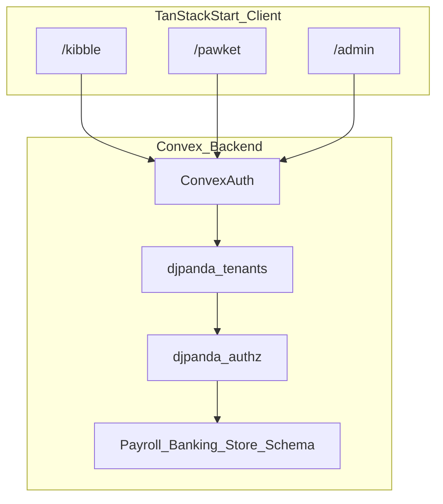

> **Repo copy:** Migrated from the Cursor plan `greenfield_stack_and_architecture_292e8344.plan.md` for working across machines. Update this file as the source of truth.

# Student Financial Literacy Ecosystem — Greenfield Plan

## Goals (from PRD)

- **One codebase, three experiences**: accounting-style student PWA (Kinetic Ledger), banking-style student PWA (Vibrant Scholar), and teacher admin — all **mobile-first PWAs** with shared Convex data.
- **Realistic flows**: payroll/earnings → banking/vaults → teacher store POS, driven by teacher inputs (attendance, hours, approvals).

## Recommended app shape

Use **one TanStack Start application** with three top-level route trees (example paths):

- `/kibble/*` — Kibble Capital (red/black/white theme, accounting UX)
- `/pawket/*` — PawKet Exchange (blue/green/yellow theme, consumer banking UX)
- `/admin/*` — Teacher Administration Hub (can reuse either design system or a neutral third theme)

**Dual PWA install surfaces** on the same origin: ship **two Web App Manifests** with different `name`, `start_url`, `scope`, `theme_color`, and icons (e.g. `public/manifest-kibble.webmanifest` scoped to `/kibble/`, `public/manifest-pawket.webmanifest` scoped to `/pawket/`). Each layout route injects the correct `<link rel="manifest" />` and meta theme color. Service worker registration should respect scopes (typically one SW per scope or a root SW that caches by path — validate during implementation).

## Design handoff (Google Stitch)

- **Source of truth for v1 visuals**: Connect **[Google Stitch](https://stitch.withgoogle.com/)** (or your Stitch → export workflow) so **Kibble Capital**, **PawKet Exchange**, and **Teacher admin** screens match your existing **v1 templates** before pixel-tweaking in code.
- **Translation layer**: Treat Stitch output as **reference**, then implement in **React + Tailwind v4 + shadcn (Base UI)** — shared primitives in `src/components/ui/`, app-specific layout and marketing in `src/components/kibble/`, `src/components/pawket/`, `src/components/admin/` (or similar). Prefer **semantic tokens** (spacing, radius, elevation) mapped to Tailwind `@theme` / CSS variables so **Kinetic Ledger** and **Vibrant Scholar** stay consistent with the PRD palette.
- **Guardrails**: If a Stitch artifact conflicts with **accessibility**, **PWA/mobile touch targets**, or **data from Convex** (real paystubs vs placeholder numbers), adjust the layout while preserving the intended hierarchy and brand feel.
- **Landings vs app chrome**: Stitch likely covers both; remember **SSR is only** for the two **public marketing landings** — keep Stitch-driven hero/marketing on those routes; signed-in dashboards from the same template library stay **client-only** as already decided.

## Stack bootstrap (official baselines)

1. **Convex + TanStack Start** — Prefer the official template to avoid manual drift:
   - `npm create convex@latest -- -t tanstack-start`
   - This aligns with Convex docs for wiring [`ConvexQueryClient`](https://docs.convex.dev/quickstart/tanstack-start), `@convex-dev/react-query`, `ConvexProvider` in the router `Wrap`, and `VITE_CONVEX_URL`.

2. **Tailwind v4 + shadcn (Base UI)** — After the app runs:
   - Follow [shadcn Tailwind v4 docs](https://ui.shadcn.com/docs/tailwind-v4) and use the CLI path that selects **Base UI** primitives (see [January 2026 Base UI changelog](https://ui.shadcn.com/docs/changelog/2026-01-base-ui)).
   - Keep generated UI in something like `src/components/ui/` and build **app-specific** shells (TopAppBar, Drawer, BottomNav) as composed components that consume shadcn primitives.
   - **Google Stitch**: wire Stitch templates into this structure (see **Design handoff (Google Stitch)** above) so v1 matches your templates without forking a second design system.

3. **Tooling** — When implementation begins, copy your **Prettier** and **ESLint** configs from the absolute path you provide on this machine into the repo root (and wire `package.json` scripts: `lint`, `format`, `typecheck`).

## Auth, tenants, and RBAC (your choices)

### Convex Auth

- Add **Convex Auth** per [Convex Auth setup](https://labs.convex.dev/auth/setup) and [product docs](https://docs.convex.dev/auth/convex-auth) (`@convex-dev/auth` / `@auth/core` patterns as documented there).
- **No public sign-up**: Onboarding is **invitation-only**. There is no `/signup` or open self-serve registration; new users enter through **tenant invitations** (email/identifier flow) and **Convex Auth** sign-in after they have a valid invite, mirroring the pattern in the reference codebase below.
- **Rendering strategy (decided)**: This is a **PWA-first** product; the signed-in experience is **client-only** end-to-end (no reliance on SSR for session, Convex queries, or money-moving UI). **SSR is intentionally narrow**: only the **public marketing landing pages** for **Kibble Capital** and **PawKet Exchange** (e.g. index routes under `/kibble` and `/pawket` that pitch install / sign-in). Everything else—including auth flows, student dashboards, teacher admin, store/POS—stays **client-rendered** so Convex Auth matches the deployment model and avoids SSR/cookie bridging complexity (see [convex-auth TanStack Start discussion](https://github.com/get-convex/convex-auth/issues/126) for context; we are not pursuing SSR for those surfaces in v1).

### Invitation-only pattern (reference: ms-engage-v2)

Implement the same **Convex + tenants + authz** shape as the **`ms-engage-v2`** reference app’s `convex/` folder (clone that repo locally to compare paths).

- **`convex/tenants.ts`**: `makeTenantsAPI(components.tenants, { authz, creatorRole, auth, getUser, ... })` and re-export the generated API surface (members, teams, invitations, permission helpers). Omit or replace `createOrganization` in the spread when you need a **custom gate** (see `organizations.ts` in that repo).
- **`convex/invitations.ts`**: Thin mutations that `getAuthUserId`, `authz.require(..., 'invitations:create', orgScope(organizationId))`, then `ctx.runMutation(components.tenants.invitations.inviteMember, { ... })` (optionally extend args, e.g. custom `expiresAt`, like the reference).
- **`convex/organizations.ts`**: If org creation must stay restricted, keep a **dedicated** `createOrganization` mutation with extra checks (reference uses a `canCreateOrganization` flag on the user document) and assign **`owner`** in authz after `components.tenants.organizations.createOrganization`.
- **`convex/authz.ts`**: `definePermissions(TENANTS_PERMISSIONS, ...)`, `defineRoles(..., TENANTS_ROLES, APP_ROLES)`, `new Authz(components.authz, { permissions, roles })` — extend `APP_ROLES` / app permissions in a small `lib/roles`-style module as in the reference.
- **`convex/http.ts`**: Register Convex Auth HTTP routes via `auth.addHttpRoutes(http)` on the Convex router.

### @djpanda/convex-tenants + @djpanda/convex-authz

- Register both components in [`convex/convex.config.ts`](convex/convex.config.ts) per [convex-tenants quick start](https://github.com/dbjpanda/convex-tenants/blob/main/docs/quick-start.md): export tenant APIs via `makeTenantsAPI()`, define permissions/roles in `convex/authz.ts`, and map **organization = classroom (or school)** with **member roles** such as `teacher` and `student`. **Concrete file layout and invitation/org-gating mutations** follow the **Invitation-only pattern** subsection and the **`ms-engage-v2`** reference `convex/` tree (not a public self-serve join).
- Express **all** privileged Convex functions (mutations/actions that move money, approve absences, POS charges) as **authz-checked** operations; keep query/mutation wrappers thin per Convex best practices.

## Convex domain model (initial tables — iterate)

Design **flat, relational** tables with indexes (Convex rules: avoid deep nesting; index by tenant + entity keys).

**Tenancy and people (often partially owned by tenants component + your extensions)**

- `students` profile extensions keyed by tenant membership (grade, external ID) as needed.
- `classSettings` (or `tenantSettings`): pay rates, tax brackets/simplified withholding parameters, pay period calendar, savings APY rules (toy but consistent).

**Payroll / Kibble**

- `payPeriods`, `payRuns`, `paystubs` (gross, line items), `deductionLines` (federal/state/FICA buckets as configured), `earningsNotifications` (optional), links to source `attendance` / `hoursEntries`.

**Banking / PawKet**

- `accounts` (checking/savings per student in tenant), `ledgerEntries` (append-only money movements), `transfers` (P2P “Zelle”), `vaults` (goals), `vaultContributions`, `interestAccruals` (scheduled internal mutation).

**Teacher hub / economy**

- `absenceRequests`, `storeCatalog`, `storeOrders` / `posTransactions` tying teacher → student → amount.

**Indexes (examples)**

- `paystubs`: by `tenantId` + `studentId` + `payPeriodId`.
- `ledgerEntries`: by `tenantId` + `accountId` + time or monotonic sequence.
- `transfers`: by `tenantId` + `createdAt` for teacher review if needed.

## TanStack Router structure

- **Root layout** ([`src/routes/__root.tsx`](src/routes/__root.tsx)): `QueryClient` context (from Convex quickstart), global fonts, optional theme class provider.
- **SSR scope**: Use **route-level** TanStack Start / Router configuration so **only** the two **public landing** routes SSR (fast first paint, SEO if needed). All nested authenticated routes under `/kibble`, `/pawket`, and `/admin` disable SSR (or equivalent client-only pattern) so Convex Auth and live Convex subscriptions run purely on the client.
- **Segment layouts**:
  - `src/routes/kibble/route.tsx` — inject Kibble manifest + CSS variables (`--brand: #e31837`, etc.); landing child may SSR, deeper routes client-only.
  - `src/routes/pawket/route.tsx` — PawKet manifest + Vibrant Scholar tokens (`--brand: #2d5bff`, etc.); same split.
  - `src/routes/admin/route.tsx` — teacher navigation shell; **client-only** (no SSR requirement).
- **Auth routes**: `/login` (and any Convex Auth callback routes); **no `/signup`**. Invitation acceptance can live on a dedicated client route (e.g. `/invite` or query-driven) aligned with `acceptInvitation` from the tenants API. Post-login redirect by **role** + last-used app; **client-only**.

## Product vertical slices (build order)

1. **Scaffold + CI hooks**: template app, Tailwind v4, shadcn Base UI, Prettier/ESLint from your machine, strict TypeScript; **configure route-level SSR so only Kibble + PawKet marketing landings SSR**, everything else client-first for Convex Auth.
2. **Identity + tenant**: Convex Auth + HTTP routes; **invitation-only** member onboarding per **`ms-engage-v2`** `convex/` (`tenants.ts`, `invitations.ts`, gated `organizations.ts` if needed); teachers invite students by identifier; dev seed for invites/users optional.
3. **Earnings loop (minimal)**: teacher logs hours → `paystub` generated from settings → student sees paystub in `/kibble`.
4. **Savings loop (minimal)**: “transfer net to bank” mutation creates checking balance + optional vault allocation in `/pawket`.
5. **Economy loop (minimal)**: teacher creates store item → POS debit against student checking.
6. **Polish**: Stitch-aligned screens where templates exist; expand **Storybook** and close layout debt from slices 2–10 (bootstrap is slice 1 — see [`docs/scope/README.md`](scope/README.md#ui-build-policy)); notifications list, charts (pick one chart lib later), PWA offline behavior scoped to safe read-only views if feasible.

## Files and folders to expect at repo root (new)

- [`convex/schema.ts`](convex/schema.ts), [`convex/convex.config.ts`](convex/convex.config.ts), [`convex/auth.ts`](convex/auth.ts) (+ Convex Auth config files per labs guide)
- [`convex/tenants.ts`](convex/tenants.ts), [`convex/authz.ts`](convex/authz.ts), [`convex/invitations.ts`](convex/invitations.ts), optional [`convex/organizations.ts`](convex/organizations.ts), [`convex/http.ts`](convex/http.ts) — mirror **`ms-engage-v2`** `convex/` invitation and org-gating patterns
- [`src/router.tsx`](src/router.tsx) — Convex + React Query integration (from template)
- [`src/routes/`](src/routes/) — file-based routes for the three apps + auth
- [`components.json`](components.json) — shadcn config (Base UI + Tailwind v4)
- [`public/manifest-*.webmanifest`](public/manifest-*.webmanifest) + icons

## Open inputs when you start implementation

- Absolute path on this machine to the **Prettier** and **ESLint** config you want cloned.
- Exact **tenant model** decision: one Convex organization per **classroom** vs per **school district** (affects invitations, roster import, and teacher permissions).
